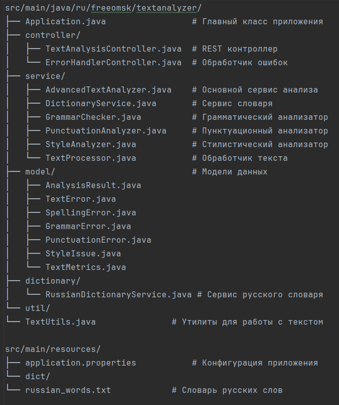

# Text Analyzer

Простой и эффективный анализатор текста на русском языке для проверки орфографии, грамматики, пунктуации и стилистики.

## 🚀 Возможности

    🔤 Орфографическая проверка - поиск орфографических ошибок с предложениями исправлений

    📝 Грамматический анализ - проверка согласования, падежей и временных форм

    ⏸️ Пунктуационная проверка - обнаружение ошибок в расстановке знаков препинания

    🎨 Стилистический анализ - выявление стилистических проблем и слов-паразитов

    📊 Метрики текста - оценка удобочитаемости и анализ содержания

    📚 Расширяемый словарь - возможность добавления пользовательских слов

## 🛠 Технологии

- Java 21 - основной язык разработки
- Spring Boot 3.2.3 - фреймворк
- Maven - управление зависимостями
- REST API - архитектура взаимодействия

## 📦 Установка и запуск

### Предварительные требования

- Java 21 или выше
- Maven 3.6 или выше

### Сборка и запуск

1. Клонируйте репозиторий:

- git clone <repository-url>
- cd text-analyzer

2. Соберите проект:

`mvn clean compile`

3. Запустите приложение:

`mvn spring-boot:run`

Приложение будет доступно по адресу: http://localhost:8080

## 📡 API Endpoints

### Проверка здоровья

`GET /api/text-analysis/health`

Ответ:

{
"status": "OK",
"service": "Text Analyzer",
"version": "1.0.0",
"dictionarySize": 150,
"timestamp": 1700000000000
}

### Анализ текста

`POST /api/text-analysis/analyze`

`Content-Type: application/json`

`{
"text": "Здавствуйте, мне бы хотелось заказать пиццу с ананасами",
"language": "ru"
}`

Ответ:

`{
"success": true,
"message": "Анализ завершен успешно",
"result": {
"originalText": "Здавствуйте, мне бы хотелось заказать пиццу с ананасами",
"language": "ru",
"spellingErrors": [
{
"text": "Здавствуйте",
"position": 0,
"description": "Слово не найдено в словаре",
"errorCode": "ORPH_UNKNOWN_WORD",
"suggestions": ["здравствуйте"]
}
],
"grammarErrors": [],
"punctuationErrors": [],
"styleIssues": [],
"metrics": {
"charCount": 52,
"wordCount": 8,
"sentenceCount": 1,
"readabilityIndex": 75.5,
"waterPercentage": 12.5
}
}
}`

### Размер словаря

`GET /api/text-analysis/dictionary/size`

Ответ:

`{
"success": true,
"dictionarySize": 150
}`

### Добавление слова в словарь

`POST /api/text-analysis/dictionary/add`

`Content-Type: application/json`

`{
"word": "новоеслово"
}
`
Ответ:

`{
"success": true,
"message": "Слово 'новоеслово' добавлено в словарь",
"dictionarySize": 151
}`

## 🧪 Тестирование
1. Использование PowerShell (Windows)

Создайте файл test.ps1:

    Write-Host "Testing Text Analyzer API..." -ForegroundColor Green

    # Проверка здоровья
    Write-Host "`n1. Health Check" -ForegroundColor Yellow
    $health = Invoke-RestMethod -Uri "http://localhost:8080/api/text-analysis/health" -Method GET
    Write-Host "Status: $($health.status)" -ForegroundColor White

    # Анализ текста
    Write-Host "`n2. Text Analysis" -ForegroundColor Yellow
    $result = Invoke-RestMethod -Uri "http://localhost:8080/api/text-analysis/analyze" -Method POST -Body '{"text":"Здавствуйте, как дела?","language":"ru"}' -ContentType "application/json"

    if ($result.success) {
    Write-Host "Analysis successful!" -ForegroundColor Green
    $totalErrors = 0
    if ($result.result.spellingErrors) { $totalErrors += $result.result.spellingErrors.Count }
    Write-Host "Total errors: $totalErrors" -ForegroundColor White
    }

Запустите скрипт:

`.\test.ps1`

Или запустите готовые скрипты _**test-api.ps1**_ и _**test-api-lite.ps1**_. 

2. Использование curl (Linux/Mac/WSL)

### Проверка здоровья
    curl http://localhost:8080/api/text-analysis/health

### Анализ текста
    curl -X POST http://localhost:8080/api/text-analysis/analyze \
    -H "Content-Type: application/json" \
    -d '{"text":"Здавствуйте, как дела?", "language":"ru"}'

## 🏗 Структура проекта

## 🔧 Конфигурация

Основные настройки в src/main/resources/application.properties:

    server.port=8080

    spring.application.name=Text Analyzer

    logging.level.ru.freeomsk.textanalyzer=INFO

## 📈 Метрики анализа

- Удобочитаемость - оценка от 0 до 100 (чем выше, тем лучше)
- Процент "воды" - содержание слов-паразитов и стоп-слов
- Количество символов, слов, предложений
- Оценка качества - автоматическая оценка от 30 до 100 баллов

## 🐛 Обработка ошибок

Приложение возвращает структурированные ошибки:

- ORPH_* - орфографические ошибки
- GRAM_* - грамматические ошибки
- PUNC_* - пунктуационные ошибки
- STYLE_* - стилистические замечания

## 🤝 Разработка

1. Добавление новых правил проверки

- Орфография - расширьте словарь в RussianDictionaryService
- Грамматика - добавьте правила в GrammarChecker
- Пунктуация - создайте новые паттерны в PunctuationAnalyzer
- Стилистика - добавьте проверки в StyleAnalyzer

2. Расширение словаря
- Добавьте слова в src/main/resources/dict/russian_words.txt или используйте API:

`Invoke-RestMethod -Uri "http://localhost:8080/api/text-analysis/dictionary/add" -Method POST -Body '{"word":"вашеслово"}' -ContentType "application/json"`